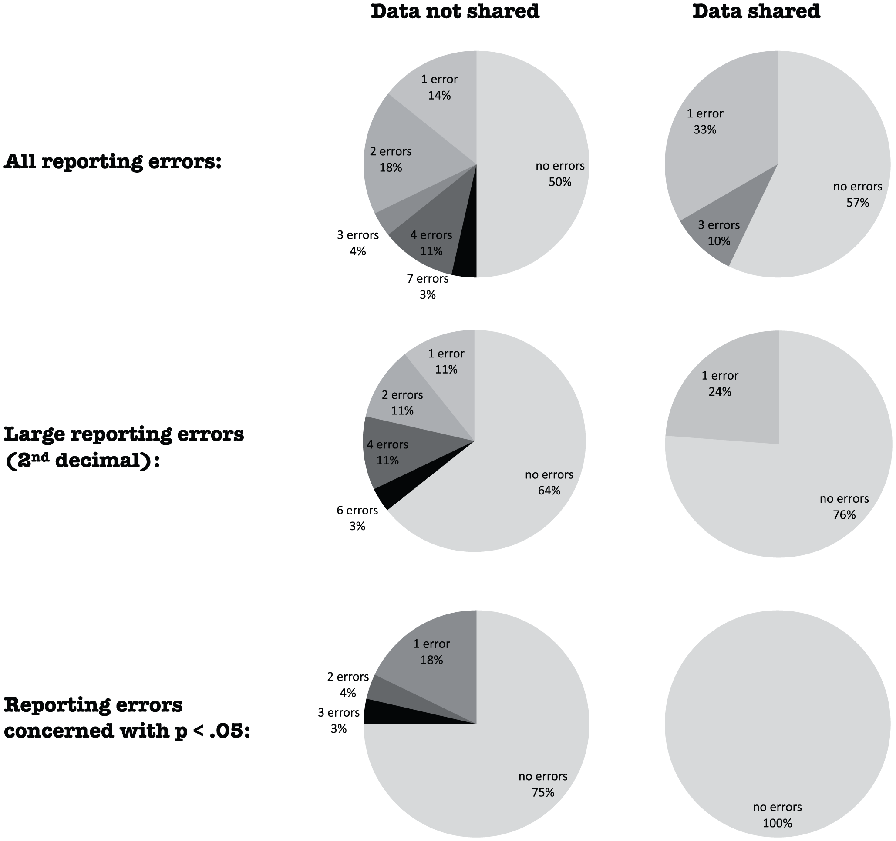

## Sharing, publishing and archiving research products

## What is the difference between sharing, publishing & archiving?

**Non-synomymous terms**

- *shared*: any way of sharing information, could mean I emailed it to you.
- *publish* : citable artifact, discoverable.
- *archive* : long-term preservation.

#### We'll be focusing on publishing and archiving

## Why, with whom, what, when, where, and how to publish & archive?

- why publish?
- who are we sharing with?
- what materials do we need to publish?
- when do we make them available?
- where do we publish various outputs?
- how do we prepare materials for publication?

For the remaining slides we will assume tour manuscript is submission ready.

## Why?

- increased visibility / citation
- funding agency / journal requirement
- community expects it

## Increased visibility and citations

[Piwowar & Vision (2013) Data reuse and the open data citation advantage.](https://dx.doi.org/10.7717/peerj.175)

## Funding agency or journal requirements

### Funding agencies
- [NIH Data Sharing policy](http://grants.nih.gov/grants/policy/data_sharing/)
- [NSF Dissemination and Sharing of Research Results poicy](http://www.nsf.gov/bfa/dias/policy/dmp.jsp)

### Journals

- [PLOS Publishing policies](http://journals.plos.org/plosone/s/editorial-and-publishing-policies)
- [Nature Publishing policies](http://www.nature.com/authors/policies/availability.html)

## Why?

- increased visibility and citationa
- funding agency / journal requirement
- community expects it
- *better research*

[Wicherts et al (2011) Willingness to Share Research Data Is Related to the Strength of the Evidence and the Quality of Reporting of Statistical Results.](http://dx.doi.org/10.1371/journal.pone.0026828)

## Why?

### Reproducibility: what’s in it for me?

*more efficient, less redundant science*
    - by allowing others to build upon our work

[Five selfish reasons to work reproducibly](http://www.genomebiology.com/2015/16/1/274) by Florian Markowetz

- Reason number 1: reproducibility helps to avoid disaster
- Reason number 2: reproducibility makes it easier to write papers
- Reason number 3: reproducibility helps reviewers see it your way
- Reason number 4: reproducibility enables continuity of your work
- Reason number 5: reproducibility helps to build your reputation

## Who?

### Whom do we need to share with?

- collaborators
- peer reviewers & journal editors
- broad scientific community
- generally the public

*For research to be reproducible, the research products (data, code) need to be publicly available in a form that people can find and understand them.*

## What?

> ## **Catalog the artifacts you produced this morning**
> - What needs to be published?
> - What does not need to be published?
> - Anything that cannot be published?
>
{: .challenge}

## Activity outcomes
